# Sepsis-Classification-with-FastAPI

This project is focused on the accurate and efficient classification of sepsis cases using the FastAPI framework. Sepsis is a critical medical condition that requires prompt identification and treatment. 


<p align="center">
  
</p>

This project aims to provide a streamlined solution for healthcare professionals to classify sepsis cases quickly and effectively.

## Table of Contents

- [Project Overview](#project-overview)
- [Getting Started](#getting-started)
- [Data](#data)
- [Modeling](#modeling)
- [Evaluation](#evaluation)
- [Deployment](#deployment)
- [Future Work](#future-work)
- [Contact](#contact)

## Project Overview

The "Sepsis Classification with FastAPI" project aims to develop an accurate and efficient classification system for sepsis cases using the FastAPI framework. Sepsis is a life-threatening condition that requires immediate medical attention. This project addresses the critical need for timely identification and classification of sepsis cases to facilitate prompt treatment and improve patient outcomes.

The objectives of the project are as follows:

1. Train a machine learning model on a diverse dataset of sepsis cases to accurately predict the likelihood of sepsis in patients.

2. Utilize the FastAPI framework to create a user-friendly and efficient web interface for healthcare professionals to interact with the sepsis classification model.

3. Improve diagnostic capabilities by achieving high accuracy, sensitivity, and specificity in sepsis classification.

4. Provide a comprehensive and scalable solution that can be easily deployed in real-time healthcare environments.

Key challenges in this project include acquiring and preprocessing a reliable sepsis dataset, selecting an appropriate machine learning algorithm, optimizing the model's performance, and deploying the system in a secure and efficient manner.

## Project Structure

- README.md
- requirements.txt
- Assets
  - Final_model.joblib
  - numerical_imputer.joblib
  - scaler.joblib
- Data
  - Paitients_Files_Test.csv
  - Paitients_Files_Train.csv
- Fastapi
  - Dockerfile
  - main.py
  - __pycache__
    - main.cpython-39.pyc
- images
- Notebooks
  - ML_Step_By_Step_Guide (1).ipynb
- Streamlit
  - Strealit_.jpg
  - streamlit_app.py
        


## Summary
| Code | Name                                                | Published Article                                                                                          | Deployed App                                                                                                 | Streamlit App                                                                                                |
|------|-----------------------------------------------------|------------------------------------------------------------------------------------------------------------|--------------------------------------------------------------------------------------------------------------|-------------------------------------------------------------------------------------------------------------|
| LP6  | Sepsis Prediction App with FastAPI and Streamlit     | [Medium Article](https://medium.com/@alidu143/deploying-fastapi-for-sepsis-occurrence-prediction-f6971aa584ff) | [FastAPI App](https://huggingface.co/spaces/Abubakari/Sepsis-fastapi-prediction-app)                        | [Streamlit App](https://huggingface.co/spaces/Abubakari/Sepsis-prediction-streamlit-app)                    |


## Project Setup

To set up the project environment, follow these steps:

1. Clone the repository:

git clone my_github 

```bash 
https://github.com/aliduabubakari/Sepsis-Classification-with-FastAPI.git
```

2. Install the required dependencies:

```bash
pip install -r requirements.txt
```

3. Create a virtual environment:

- **Windows:**
  ```bash
  python -m venv venv
  venv\Scripts\activate
  ```

- **Linux & MacOS:**
  ```bash
  python3 -m venv venv
  source venv/bin/activate
  ```

You can copy each command above and run them in your terminal to easily set up the project environment.


## Data

The data used in this project consists of a diverse collection of sepsis cases obtained from [Sepsis](https://www.kaggle.com/datasets/chaunguynnghunh/sepsis?select=README.md).

## Data Fields

| Column Name | Data Features | Description                                      |
|-------------|-----------------|--------------------------------------------------|
| ID          | N/A             | Unique number to represent patient ID             |
| PRG         | Attribute 1     | Plasma glucose                                   |
| PL          | Attribute 2     | Blood Work Result-1 (mu U/ml)                    |
| PR          | Attribute 3     | Blood Pressure (mm Hg)                           |
| SK          | Attribute 4     | Blood Work Result-2 (mm)                         |
| TS          | Attribute 5     | Blood Work Result-3 (mu U/ml)                    |
| M11         | Attribute 6     | Body mass index (weight in kg/(height in m)^2)   |
| BD2         | Attribute 7     | Blood Work Result-4 (mu U/ml)                    |
| Age         | Attribute 8     | Patient's age (years)                            |
| Insurance   | N/A             | If a patient holds a valid insurance card         |
| Sepsis      | Target          | Positive: if a patient in ICU will develop sepsis,<br> Negative: otherwise |


## Exploratory Data Analysis

During the exploratory data analysis (EDA) phase, a comprehensive investigation of the sepsis dataset was conducted to gain insights through various types of analyses.

- **Univariate analysis:** A thorough examination of each variable individually was performed. Summary statistics such as mean, median, standard deviation, and quartiles were calculated to understand the central tendency and spread of the data.

<p align="center">
  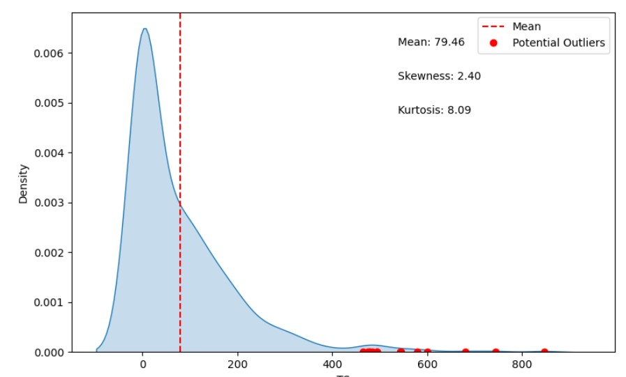
</p>

- **Bivariate analysis:** Relationships between pairs of variables were explored to identify patterns and potential predictor variables for sepsis classification.

<p align="center">
  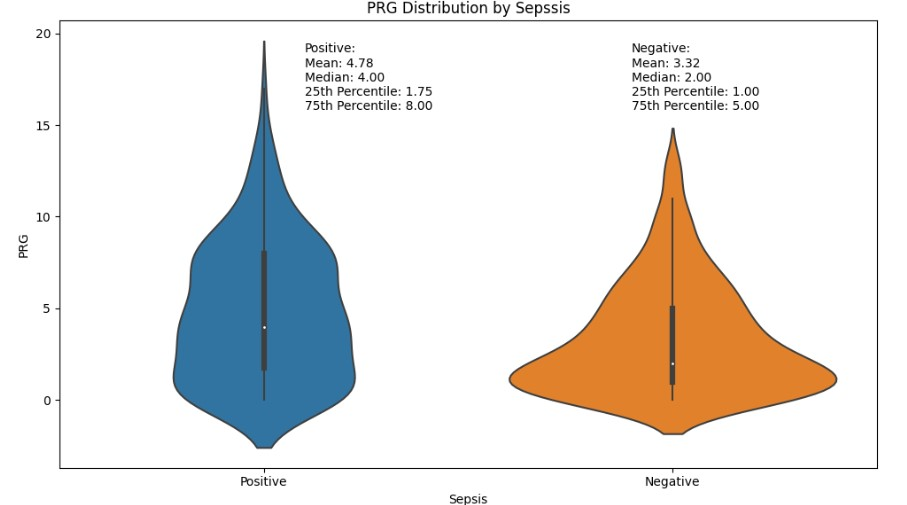
</p>

- **Multivariate analysis:** Relationships among multiple variables were examined simultaneously, allowing for a deeper understanding of their interactions and impact on sepsis.

<p align="center">
  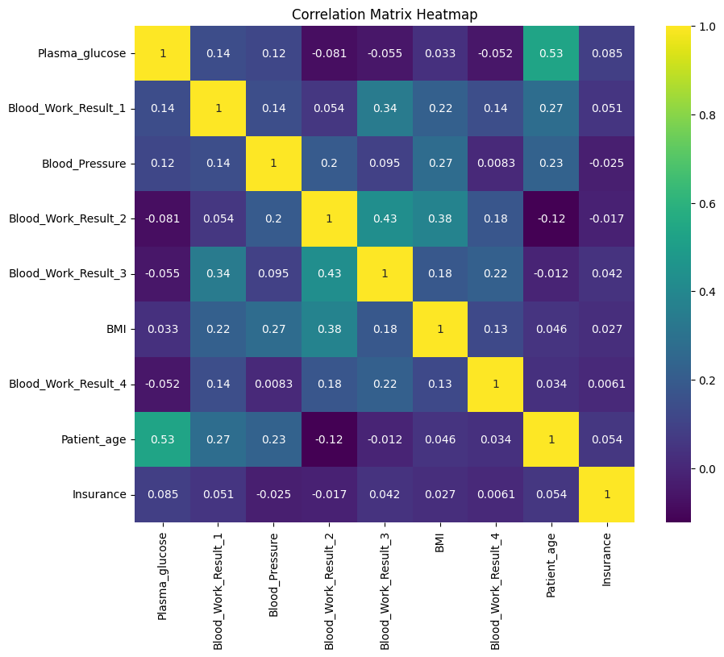
</p>

In addition to these exploratory analyses, hypotheses were formulated based on prior knowledge and existing research. Statistical tests such as t-tests, chi-square tests, or ANOVA tests were utilized to test these hypotheses, depending on the nature of the variables. The results of these tests validated or refuted the formulated hypotheses and provided further insights into the relationships between variables.


### Hypotheses:

<p align="center">
  
</p>


- **Hypothesis 1:** Higher plasma glucose levels (PRG) are associated with an increased risk of developing sepsis.

- **Hypothesis 2:** Abnormal blood work results, such as high values of PL, SK, and BD2, are indicative of a higher likelihood of sepsis.

- **Hypothesis 3:** Older patients are more likely to develop sepsis compared to younger patients.

- **Hypothesis 4:** Patients with higher body mass index (BMI) values (M11) have a lower risk of sepsis.

- **Hypothesis 5:** Patients without valid insurance cards are more likely to develop sepsis.

These hypotheses, along with the results of the EDA, contribute to a deeper understanding of the dataset and provide valuable insights for further analysis and model development.


## Modeling


<p align="center">
  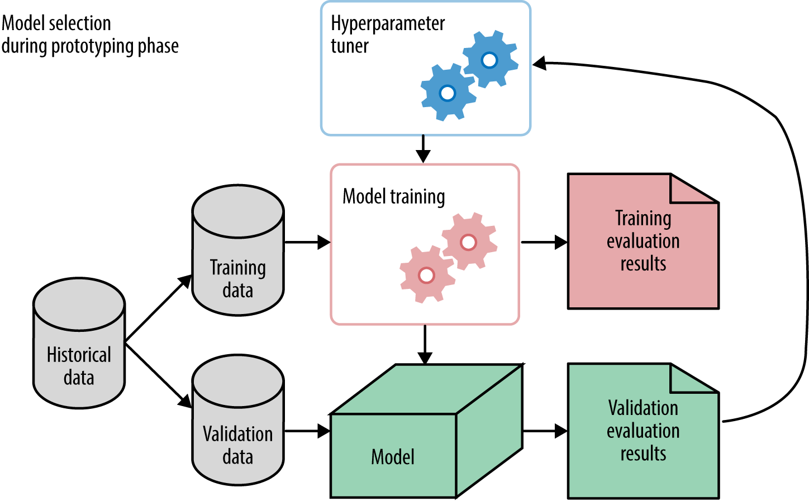
</p>

During the modeling phase, the evaluation of models took into consideration the imbalanced nature of the data. The main metrics used to assess model performance were the F1 score and AUC score, which provide a balanced assessment for imbalanced datasets.

The following models were evaluated:

- **Decision Tree:** The Decision Tree model achieved an F1 score of 0.602 and an AUC score of 0.725.

- **Logistic Regression:** The Logistic Regression model demonstrated improved performance with an F1 score of 0.634 and an AUC score of 0.750.

- **Naive Bayes:** The Naive Bayes model obtained an F1 score of 0.575 and an AUC score of 0.692.

- **Support Vector Machines (SVM):** The SVM model yielded an F1 score of 0.564 and an AUC score of 0.717.

- **Random Forest:** The Random Forest model achieved an F1 score of 0.548 and an AUC score of 0.683.

These models were evaluated based on their F1 and AUC scores, providing insights into their performance on the imbalanced dataset.


## Evaluation

<p align="center">
  
</p>

Given the imbalanced nature of the data, the models' performance was assessed using the F1 score, which considers both precision and recall, providing a balanced measure of accuracy. Additionally, the AUC score was considered to evaluate the models' ability to distinguish between positive and negative cases.

<p align="center">
  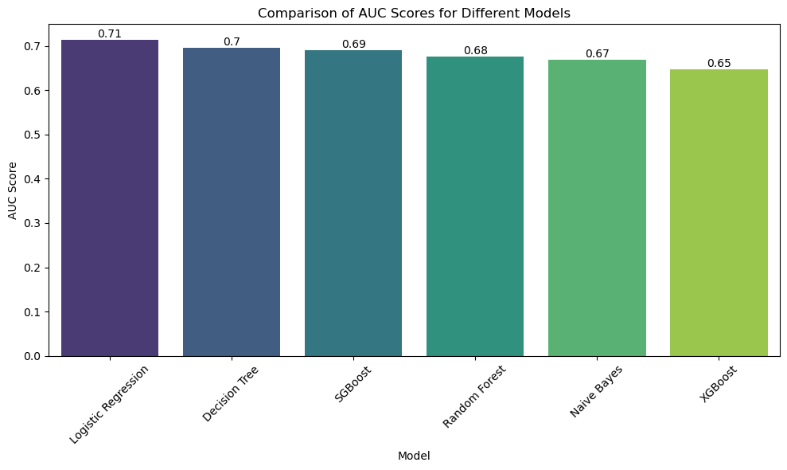
</p>

Hyperparameter tuning was also implemented to optimize the performance of the models. By fine-tuning the hyperparameters, it was possible to identify the best combination of parameter values that yielded the highest performance for each model. 

## Deployment

### Fastapi deployment 

<p align="center">
  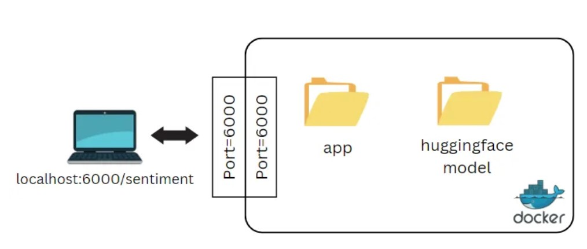
</p>

1. Make sure you have FastAPI and any necessary dependencies installed. You can install FastAPI using pip:

```bash
pip install fastapi
```

2. Open a terminal or command prompt and navigate to the directory where your main.py file is located.

3. Run the FastAPI application using the uvicorn command, specifying the module and application name:

```bash
uvicorn main:app --reload
```
4. After running the command, you should see output indicating that the FastAPI application is running and listening on a specific address (e.g., http:localhost:8000). This address represents the API endpoint where you can access your application.

5. Open a web browser or use an API testing tool (e.g., Postman) to interact with your deployed FastAPI application. Use the API endpoint provided in the terminal to make requests and receive responses.

#### API Documentation
The API documentation provides details about the available endpoints, request and response formats, and example usage. You can access the documentation by visiting the /docs endpoint after starting the server (http://localhost:8000/docs).

<p align="center">
  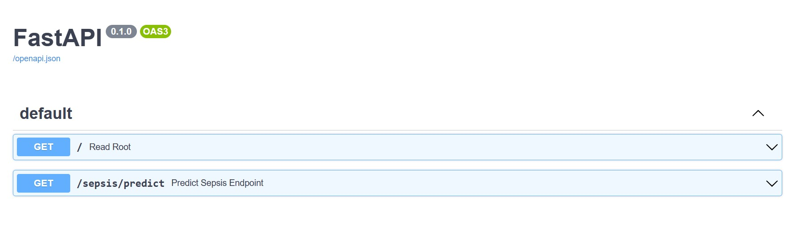
</p>

<p align="center">
  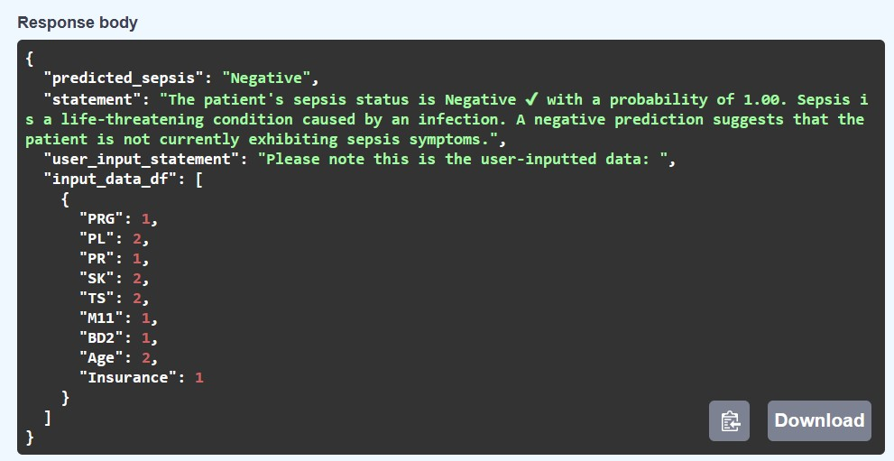
</p>


### Containerized deployment 

To run the Docker container based on the provided Dockerfile, follow these steps:

1. Make sure you have Docker installed on your system.

2. Create a new file named Dockerfile (without any file extension) in the root directory of your project.

3. Copy the content of the Dockerfile you provided into the newly created Dockerfile.

4. Open a terminal or command prompt and navigate to the directory where the Dockerfile is located.

5. Build the Docker image by running the following command:

```bash
docker build -t your-image-name .
```

6. Replace your-image-name with the desired name for your Docker image. The . at the end denotes the current directory as the build context.

7. Once the image is built, you can run a Docker container based on that image using the following command:

```bash
docker run -d -p host-port:container-port your-image-name
```
Replace host-port with the port number on your host machine that you want to map to the container's port, and replace container-port with the port number specified in the Dockerfile's EXPOSE instruction (in this case, it's 8000).

For example, if you want to map the container's port 8000 to port 8080 on your host machine, the command would be:

```bash
docker run -d -p 8080:8000 your-image-name
```

8. After running the command, the Docker container will start, and your FastAPI application will be running inside the container.

<p align="center">
  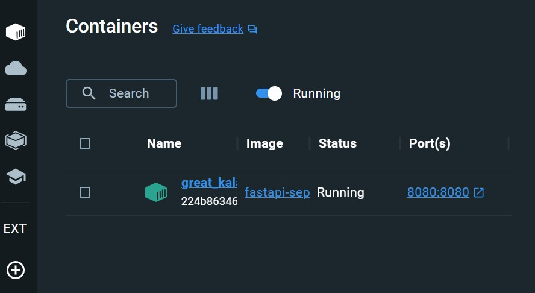
</p>


9. You can access your application by visiting http://localhost:host-port in your web browser or using an API testing tool.

For example, if you mapped the container's port 8000 to your host's port 8080, you would access the application at http://localhost:8080.

### Streamlit deployment 

Navigate to the cloned repository and run the command:

```bash 
pip install -r requirements.txt
``` 
To run the demo app (being at the repository root), use the following command:
```bash 
streamlit run streamlit_app.py
```

##### App Execution on Huggingface

Here's a step-by-step process on how to use the [Streamlit App](https://huggingface.co/spaces/Abubakari/Sepsis-prediction-streamlit-app) on Huggingface:


<p align="center">
  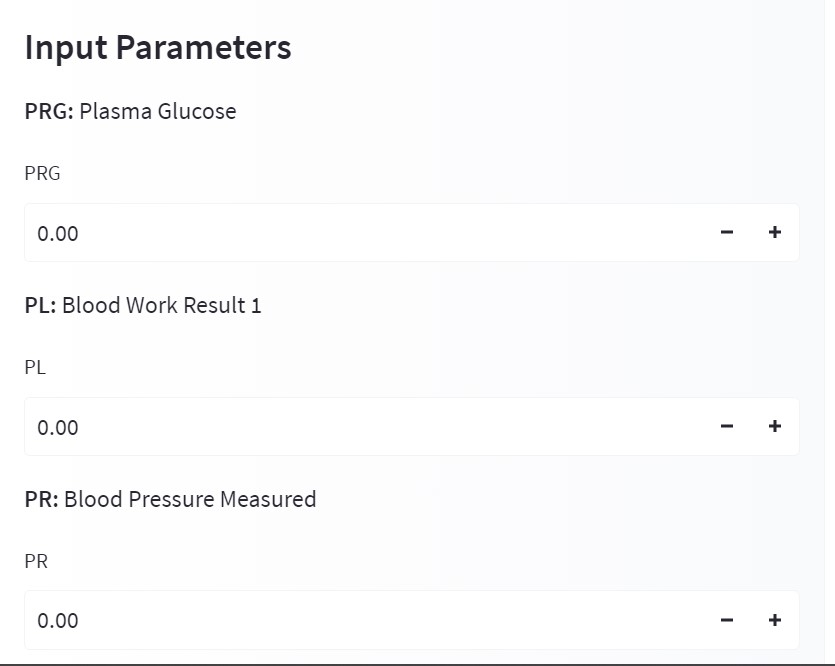
</p>

<p align="center">
  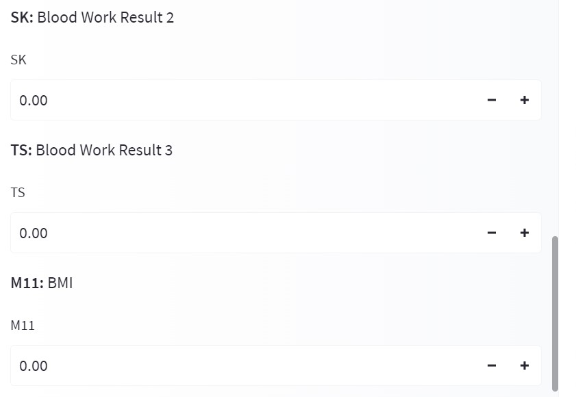
</p>

<p align="center">
  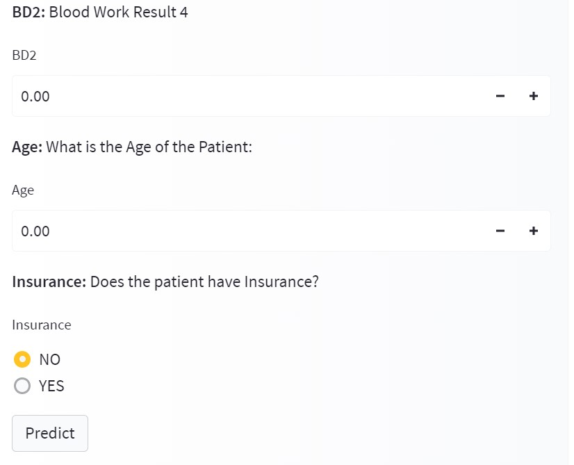
</p>

<p align="center">
  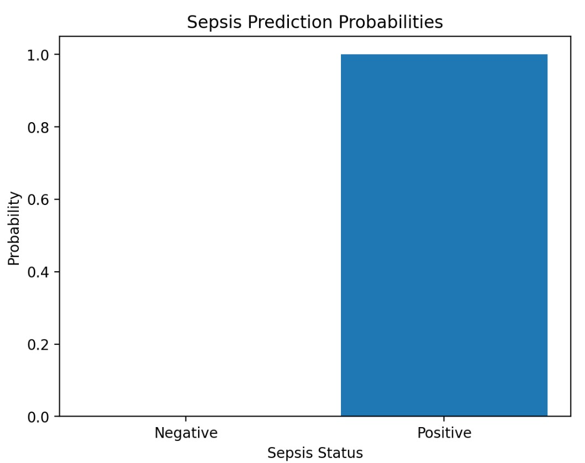
</p>


## Future Work

<p align="center">
  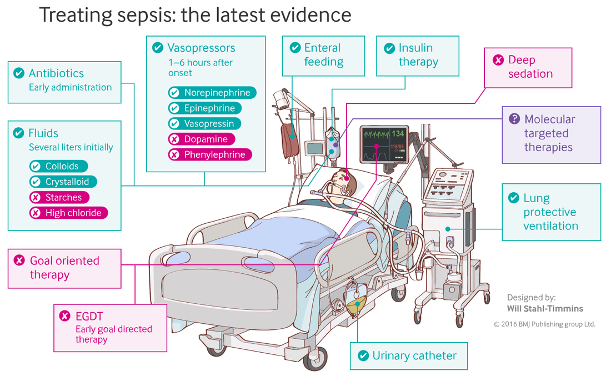
</p>


For future work, incorporating clustering algorithms can be a valuable addition to sepsis identification and classification. Clustering algorithms can help in grouping similar patient data together based on patterns and similarities.

## Contact
`Alidu Abubakari`

`Data Analyst`
`Azubi Africa`

- [](https://www.linkedin.com/in/alidu-abubakari-2612bb57/) 


